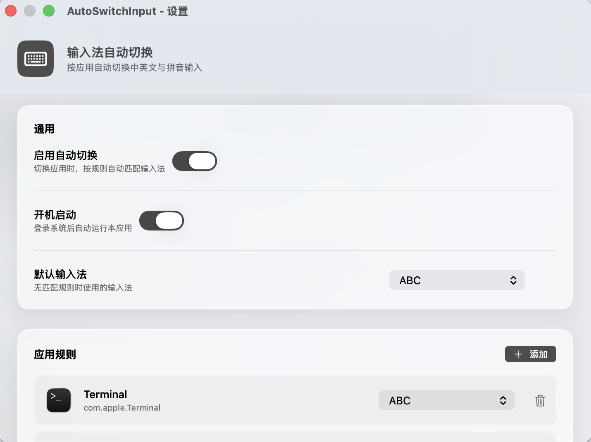

# AutoSwitchInput

> 按应用自动切换 macOS 输入法的菜单栏小工具。
> A tiny menu-bar utility that auto-switches your macOS input source per app.

---

## 简介 / Introduction

**中文** — AutoSwitchInput 是一个纯原生的 macOS 菜单栏应用。当你在不同 App 之间切换时，它会按照预设规则自动把输入法切到对应状态：比如终端类应用一律用英文（ABC），微信这类聊天应用自动切到中文拼音。告别反复手动切换输入法的烦恼。

**English** — AutoSwitchInput is a native macOS menu-bar app. As you switch between foreground apps, it automatically selects the input source defined by your rules — for example, terminal apps always switch to English (ABC), while chat apps like WeChat switch to Pinyin. No more toggling input methods by hand.

---

## 功能特性 / Features

- **按应用自动切换** / **Per-app auto switch** — 监听前台 App 切换，80ms 防抖后匹配规则并切换输入法 / Watches the active app (80ms debounce) and applies the matching rule.
- **规则化管理** / **Rule-based** — 每条规则 = 应用（Bundle ID）+ 目标输入法，支持下拉选择、即时生效 / Each rule maps a bundle ID to an input source, with a live dropdown picker.
- **内置默认规则** / **Sensible defaults** — 首次启动自动写入：Terminal / iTerm2 / VS Code / Xcode / Warp → ABC（英文）；微信 → 拼音（简体）/ Seeded on first launch: Terminal/iTerm2/VS Code/Xcode/Warp → ABC; WeChat → Pinyin.
- **双入口** / **Two entries** — 同时拥有 Dock 图标与菜单栏常驻图标；点击菜单栏图标左键打开主窗口，右键弹出菜单 / Both a Dock icon and a persistent status-bar item (left-click opens the window, right-click shows a menu).
- **液态玻璃界面** / **Liquid Glass UI** — 在 macOS 26 (Tahoe) 上呈现系统原生液态玻璃质感（窗口材质 + 卡片玻璃 + 规则行玻璃），旧系统自动回退为毛玻璃 / Native Liquid Glass on macOS 26 (Tahoe); gracefully falls back to a thin-material look on older macOS.
- **深灰主题** / **Deep-gray theme** — 统一深灰强调色与 Dock 图标，取代默认蓝色 / A consistent deep-gray accent and app icon, replacing the default blue.
- **开机启动** / **Launch at login** — 通用设置中一键开启「登录后自动运行」/ Toggle "launch at login" in General settings.
- **⌘W 关闭窗口** / **⌘W to close** — 关闭主窗口后应用常驻菜单栏，点 Dock 图标可随时重新打开 / Closing the window keeps the app resident in the menu bar; click the Dock icon to reopen.

---

## 系统要求 / Requirements

- **macOS 14.0 或更高** / **macOS 14.0+**
- **Apple Silicon（arm64）** / **Apple Silicon (arm64)**
- 输入法切换依赖系统授权，首次使用可能需在 **系统设置 › 隐私与安全性 › 输入监控 / 辅助功能** 中允许本应用 / Input switching requires system authorization; you may need to grant **Input Monitoring / Accessibility** permission in System Settings on first use.
- 若从源码构建，需要 **Xcode 命令行工具**（`xcode-select --install`）/ Building from source requires the **Xcode Command Line Tools**.

---

## 安装 / Installation

**方式一：源码构建（推荐）** / **Option A: Build from source (recommended)**

```bash
cd AutoSwitchInput
bash build.sh
open /Applications/AutoSwitchInput.app
```

`build.sh` 会编译 arm64 二进制、打包为 `.app`、ad-hoc 签名，并自动部署到 `/Applications`。

**Option B: 直接运行工作区构建** / **Option B: Run the workspace build**

```bash
cd AutoSwitchInput
bash build.sh
open AutoSwitchInput.app
```

> 若 macOS 拦截未签名应用：系统设置 › 隐私与安全性 › 仍要打开。
> If macOS blocks the unsigned app: System Settings › Privacy & Security › Allow Anyway.

---

## 使用 / Usage

1. 启动后主窗口自动弹出；窗口关闭后应用常驻菜单栏 / The main window opens on launch; after closing, the app stays in the menu bar.
2. **通用** / **General**
   - 启用自动切换：总开关 / *Enable auto switch* — master toggle.
   - 默认输入法：无匹配规则时的兜底输入法 / *Default input source* — fallback when no rule matches.
   - 开机启动：登录后自动运行 / *Launch at login*.
3. **应用规则** / **App rules**
   - 每行一个应用，右侧下拉选择目标输入法，垃圾桶图标删除规则 / One row per app; pick the target input source from the dropdown; click the trash to remove.
   - 点击「添加规则」从正在运行的 App 中选择 / Click *Add Rule* to pick from currently running apps.
4. 切换应用即可看到输入法自动跟随规则变化 / Switch apps and watch the input source follow your rules.

---

## 界面预览 / Preview

> 下图为界面示意图，风格与真实运行效果一致；真实截图见 [docs/screenshots](./docs/screenshots)。
> The image below is a mockup matching the actual UI; real captures live in [docs/screenshots](./docs/screenshots).



---

## 项目结构 / Project Structure

```
AutoSwitchInput/
├── Sources/
│   ├── main.swift              # AppKit 入口，驱动 AppDelegate（替代 @main）
│   ├── AppDelegate.swift       # 状态栏、窗口、⌘W、Dock 重开逻辑
│   ├── AppMonitor.swift        # 监听前台 App 切换
│   ├── InputMethodManager.swift # Carbon TIS API 封装
│   ├── RuleStore.swift         # 规则持久化（UserDefaults）+ 开机启动
│   ├── SettingsView.swift      # SwiftUI 主界面（液态玻璃）
│   └── Design.swift            # 设计令牌与 LiquidGlass 修饰符
├── Resources/
│   ├── Info.plist
│   ├── AppIcon.icns            # 深灰键盘 Dock 图标
│   └── icon_src/gen_dock_icon.swift  # 图标生成脚本
├── build.sh                    # 编译 + 打包 + 部署脚本
├── LICENSE                     # GPLv3
└── README.md
```

---

## 技术栈 / Tech Stack

Swift 6 · SwiftUI · AppKit · Carbon TIS API · `swiftc` 直接编译（无 Xcode 工程）· ad-hoc 签名 · `SMAppService.mainApp` 登录项。

---

## 许可证 / License

本项目以 **GNU General Public License v3.0 (GPLv3)** 开源。详见 [LICENSE](./LICENSE)。

Licensed under the **GNU General Public License v3.0 (GPLv3)**. See [LICENSE](./LICENSE).
